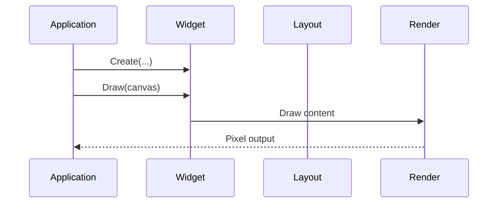

# <Widget Name> Specification

**Version**: 0.1

## Interface

```cpp
namespace native::ui {

class <Widget> : public <Base> {
public:
  template <typename... Args>
  explicit <Widget>(Args&&... args);

  // — Drawing —
  void Draw(Canvas& canvas) override;

  // — Layout —
  Widget* ChildAt(int index) override;
  int ChildCount() const override;
};

}  // namespace native::ui
```

## Behavior



## Edge Cases

- What happens when <condition>?
- How does it behave with <boundary value>?

## Test Points

- [ ] <testable assertion 1>
- [ ] <testable assertion 2>
