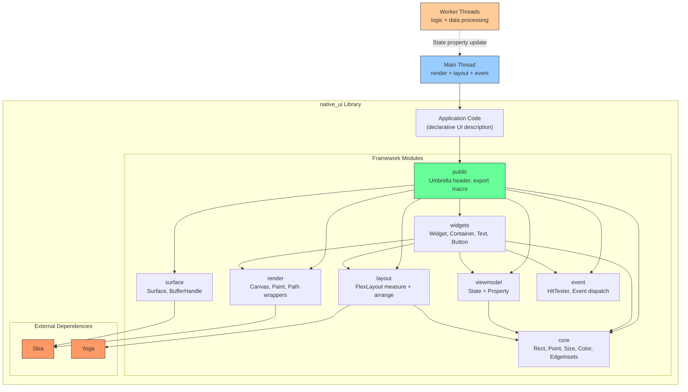
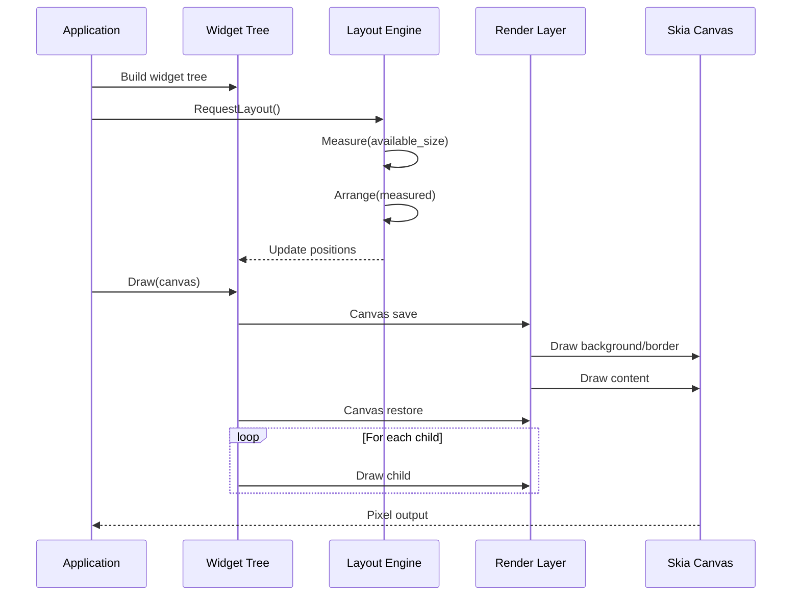
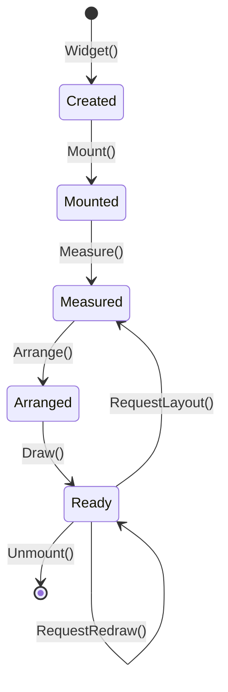
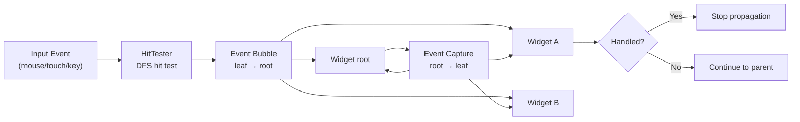
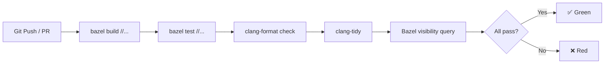

# Implementation Plan: Architecture & Engineering Design

**Branch**: `002-architecture-engineering-design` | **Date**: 2026-07-29 | **Spec**: [spec.md](spec.md)

**Input**: Feature specification from `specs/002-architecture-engineering-design/spec.md`

## Summary

Design and document the complete architecture of the native_ui framework — module boundaries, interface contracts, widget lifecycle, layout pipeline, event system, rendering architecture, **data binding (React-inspired `State` pattern)**, threading model (main thread for render/layout/event, worker threads for logic), and logging slot interface (LogSlot). Deliver architecture decision records (ADRs), API contracts, engineering standards, CI/CD pipeline, release process, and spec-kit templates. This phase produces **design artifacts only** — no runtime code.

## Technical Context

**Language/Version**: C++17 (as established in P1)

**Build System**: Bazel 6.5.0

**Primary Dependencies**: Skia (rendering), Yoga (flexbox layout), googletest (testing), bazel_skylib (build helpers)

**Storage**: N/A (library project, no persistent storage)

**Testing**: googletest with unit tests, integration tests, and golden image tests

**Target Platform**: macOS ARM64 (development), Linux x86_64 (CI/release)

**Project Type**: C++ shared library with public C API

**Performance Goals**: Widget tree layout + render under 16ms (60 fps) for simple hierarchies (<100 widgets)

**Constraints**: Skia must be isolated behind the render/ and surface/ modules; no other module may depend on Skia directly. Build must work on both macOS ARM64 and Linux x86_64. C++17 standard only.

**Scale/Scope**: Single library with 8 internal modules (core, layout, render, surface, viewmodel, widgets, event, public) + examples + tests + spikes.

## Constitution Check

*GATE: Must pass before Phase 0 research. Re-check after Phase 1 design.*

Constitution file (`.specify/memory/constitution.md`) contains placeholder template content only — no project-specific principles, constraints, or gates have been defined.

- **Gate 1 — Project principles**: No binding principles defined. PASS.
- **Gate 2 — Constraints**: No binding constraints defined. PASS.
- **Gate 3 — Governance**: No governance rules defined. PASS.

**Verdict**: All gates pass. Constitution is a template awaiting project-specific content.

## Project Structure

### Documentation (this feature)

```text
specs/002-architecture-engineering-design/
├── spec.md              # Feature specification
├── plan.md              # This file
├── research.md          # Phase 0 research output
├── data-model.md        # Phase 1 data/entity model
├── quickstart.md        # Phase 1 developer quickstart
├── contracts/           # Phase 1 interface contracts
│   ├── public-api.md    # Public API surface contract
│   ├── widget-contract.md
│   ├── layout-contract.md
│   ├── render-contract.md
│   └── event-contract.md
└── tasks.md             # Phase 2 task breakdown
```

### Source deliverables

```text
native_ui/doc/architecture/
├── README.md                    # Architecture overview, key decisions index
├── module-dependencies.md       # Formal module dependency graph with visibility rules
├── error-handling.md            # Error propagation strategy
├── memory-model.md              # Ownership model, WidgetPtr vs raw pointer conventions
├── lifecycle-model.md           # Widget lifecycle state machine
├── data-binding.md              # State + Property<T> pattern, typed Watch, extension hooks
├── threading.md                 # Threading model: main thread (render/layout/event) + worker threads (logic), State cross-thread bridge
└── logging-slot.md              # LogSlot abstract interface, slot pattern, plug-in by consumer

native_ui/doc/api/
├── widget-contract.md           # Widget virtual interface, extension points
├── layout-contract.md           # FlexLayout interface, measure/arrange protocol
├── render-contract.md           # Canvas/Paint/Path contract, Skia isolation rules
├── event-contract.md            # Event dispatch protocol, bubble/capture
└── viewmodel-contract.md        # State + Property<T> API, typed Watch, extension hooks

native_ui/doc/
├── testing-strategy.md          # Unit test structure, mock patterns, golden tests
├── build-conventions.md         # BUILD file conventions, dep prefix rules, visibility
├── agent-instructions.md        # Standard prompt template for opencode agents
├── ci-strategy.md               # CI architecture doc
└── release-process.md           # Release workflow, versioning, publishing

.github/workflows/
├── ci.yml                       # CI pipeline: build, test, format, lint
├── pr.yml                       # PR gate: same checks + review approval
└── release.yml                  # Release workflow: tag → build → publish

spec/native_ui/
├── _template.yaml               # spec-kit YAML template
└── _template_layout.md          # Alternative markdown template

CHANGELOG.md                     # Placeholder, populated on each release
```

**Structure Decision**: Documentation mirrors the module structure of the C++ source code. Architecture documents are nested under `doc/architecture/` to keep them separate from API contracts (`doc/api/`) and engineering standards (`doc/` root). CI/CD configs follow GitHub Actions convention under `.github/workflows/`. Spec-kit templates live alongside other spec files under `spec/native_ui/`.

## Architecture Overview (Phase 2 Deliverable)

### Module Architecture



### Render Pipeline



### Widget Lifecycle



### Event Dispatch



### CI Pipeline



### Threading Architecture

**Frame Loop (React-inspired batch model)**:

```
state->count = 1;     // Property<int>::operator= → mark dirty
state->count = 2;     // mark dirty, DON'T render yet
                       ↓  (end of event loop, batch flush)
                 batched RequestRedraw
                 Layout + Render (once)
                 Fire PostNextFrame callbacks
```

State property changes are automatically **batched within a single frame**, analogous to React's `setState` batching — multiple property mutations before the render phase trigger only one layout + render pass. No explicit `nextTick` or `flushSync` is required because the frame loop naturally coalesces all pending changes.

Two lightweight scheduling primitives are exposed on the main thread:

| Primitive | Behavior | React analog |
|-----------|----------|--------------|
| `PostTask(callback)` | Run before next frame render phase (FIFO queue) | `queueMicrotask` |
| `PostNextFrame(callback)` | Run after current frame's render completes | `useEffect` cleanup timing |
| `ScheduleTimer(delay, callback)` | Run after delay, cross-frame | `setTimeout` |

```mermaid
flowchart TB
    subgraph "Main Thread Frame Loop"
        TASKS["PostTask Queue<br/>(high priority)"]
        EVT["Event Dispatch"]
        BATCH["Batch State Changes<br/>(React-style coalesce)"]
        LAY["Layout Calculation"]
        REN["Skia Rendering"]
        NEXT["PostNextFrame Callbacks"]
        IDLE["Wait vsync"]
    end

    subgraph "Worker Threads"
        LOGIC["Business Logic<br/>Data Processing"]
        VM_UP["State Property Update<br/>(thread-safe)"]
    end

    TASKS --> EVT
    EVT --> BATCH
    BATCH --> LAY
    LAY --> REN
    REN --> NEXT
    NEXT --> IDLE
    IDLE -->|next vsync| TASKS

    LOGIC -->|Post result| VM_UP
    VM_UP -->|Notify main thread| BATCH

    style "Main Thread Frame Loop" fill:#e1f5fe,stroke:#0288d1
    style "Worker Threads" fill:#fff3e0,stroke:#f57c00
```

### Logging Slot Interface

```mermaid
flowchart LR
    subgraph "Framework (native_ui)"
        CALLER["Any Module<br/>calls Log(level, msg)"]
        SINK["LogSlot Interface<br/>virtual void Log()"]
    end

    subgraph "Consumer (plug-in)"
        IMPL["Concrete LogSlot<br/>spdlog / printf / custom"]
    end

    SINK -.->|implemented by| IMPL
    CALLER --> SINK

    style "Framework (native_ui)" fill:#e8f5e9,stroke:#388e3c
    style "Consumer (plug-in)" fill:#fce4ec,stroke:#c62828
```

## Complexity Tracking

N/A — No constitution violations to justify.
