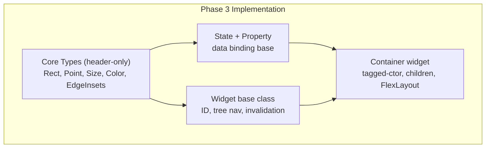

# Implementation Plan: Core Types & Widget Foundation + State

**Branch**: `003-core-types-state` | **Date**: 2026-07-29 | **Spec**: [spec.md](spec.md)

**Input**: Feature specification from `specs/003-core-types-state/spec.md`

## Summary

Implement the foundational C++ types (`Rect`, `Point`, `Size`, `Color`, `EdgeInsets`), the `State` base class with `Property<T>` template for data binding, the `Widget` base class with tree navigation and invalidation, and the `Container` widget with tagged-parameter constructor and FlexLayout integration.

## Technical Context

**Language/Version**: C++17

**Build System**: Bazel 6.5.0

**Primary Dependencies**: googletest (testing), Yoga (FlexLayout, via Container linking)

**Storage**: N/A

**Testing**: googletest with unit tests and integration tests

**Target Platform**: macOS ARM64 (development), Linux x86_64 (CI)

**Project Type**: C++ library (internal modules)

**Performance Goals**: Core types are header-only zero-cost abstractions. Property notification must not allocate per-assignment in the common case.

**Constraints**: C++17 only, no exceptions. State property updates must be thread-safe. Core types must be trivially copyable where possible.

**Scale/Scope**: 3 modules (core, state, widgets) × ~15 source files + test files.

## Constitution Check

*GATE: Must pass before Phase 0 research. Re-check after Phase 1 design.*

Constitution file contains placeholder template content — no binding principles defined.

- **Gate 1**: No binding principles. PASS.
- **Gate 2**: No binding constraints. PASS.
- **Gate 3**: No governance rules. PASS.

## Project Structure

### Documentation (this feature)

```text
specs/003-core-types-state/
├── spec.md              # Feature specification
├── plan.md              # This file
├── research.md          # Phase 0 research output
├── data-model.md        # Phase 1 data/entity model
├── quickstart.md        # Phase 1 developer quickstart
├── contracts/           # Phase 1 interface contracts
│   ├── core.md          # Rect, Point, Size, Color, EdgeInsets contract
│   ├── state.md         # State + Property<T> contract
│   └── widget.md        # Widget, Container contract
└── tasks.md             # Phase 2 task breakdown
```

### Source Code (repository root)

```text
native_ui/src/framework/
├── core/
│   ├── BUILD.bazel
│   ├── rect.h          # Rect — position, size, containment, intersection
│   ├── point.h         # Point — x, y
│   ├── size.h          # Size — width, height
│   ├── color.h         # Color — RGBA, named constants
│   └── edge_insets.h   # EdgeInsets — top, left, bottom, right
├── state/
│   ├── BUILD.bazel     # exists from P1 stub
│   ├── state.h         # State base class
│   ├── state.cc        # State implementation
│   └── property.h      # Property<T> + PropertyBase + PropertyProxy
└── widgets/
    ├── BUILD.bazel
    ├── widget.h         # Widget base class
    ├── widget.cc        # Widget implementation (FindById, invalidation)
    ├── container.h      # Container widget
    └── container.cc     # Container tagged-ctor, AddChild, Draw

tests/
├── core_test.cc         # Rect, Point, Size, Color, EdgeInsets tests
├── state_test.cc        # State + Property<T> tests
├── widget_test.cc       # Widget + Container tests
└── integration/
    └── container_layout_test.cc  # Container → FlexLayout end-to-end
```

**Structure Decision**: Each module gets its own directory under `src/framework/`. No header-only for State/Property (has .cc). Core types are header-only. Widget base has both .h and .cc. Every source file has a corresponding test.

## Complexity Tracking

N/A — No constitution violations.

## Implementation Flow


