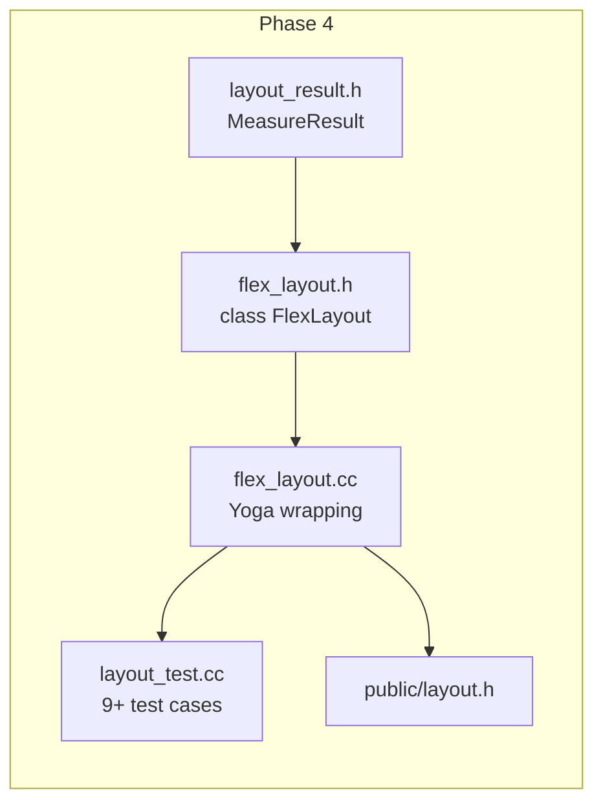

# Implementation Plan: Flexbox Layout Engine

**Branch**: `004-flexbox-layout-engine` | **Date**: 2026-07-29 | **Spec**: [spec.md](spec.md)

**Input**: Feature specification from `specs/004-flexbox-layout-engine/spec.md`

## Summary

Wrap Yoga's C API into a `FlexLayout` C++ class with tagged-parameter construction, Measure/Arrange pipeline, and proper YGNodeRef lifecycle management. Expose `MeasureResult` for downstream use by Container.

## Technical Context

**Language/Version**: C++17

**Build System**: Bazel 6.5.0

**Primary Dependencies**: Yoga (via `@yoga//:yoga`), core types (Rect, Point, Size)

**Storage**: N/A

**Testing**: googletest

**Target Platform**: macOS ARM64 (development), Linux x86_64 (CI)

**Project Type**: C++ library (internal layout module)

**Performance Goals**: Measure/Arrange on 100 children under 1ms

**Constraints**: C++17 only, no exceptions. Must not leak YGNodeRef. YGNodeCalculateLayout is single-threaded.

**Scale/Scope**: Single module (layout) with ~3 source files + tests.

## Constitution Check

*GATE: Must pass before Phase 0 research. Re-check after Phase 1 design.*

Constitution file contains placeholder template content — no binding principles defined. All gates PASS.

## Project Structure

### Documentation (this feature)

```text
specs/004-flexbox-layout-engine/
├── spec.md              # Feature specification
├── plan.md              # This file
├── research.md          # Phase 0 research output
├── data-model.md        # Phase 1 data/entity model
├── quickstart.md        # Phase 1 developer quickstart
├── contracts/           # Phase 1 interface contracts
│   └── flex-layout.md   # FlexLayout API contract
└── tasks.md             # Phase 2 task breakdown
```

### Source Code (repository root)

```text
native_ui/src/framework/layout/
├── BUILD.bazel           # cc_library with deps on core + yoga
├── flex_layout.h         # FlexLayout class + tag types + MeasureResult
├── flex_layout.cc        # Yoga wrapping implementation

native_ui/src/framework/public/include/native_ui/
├── layout.h              # Re-export FlexLayout

native_ui/tests/
├── layout_test.cc        # Unit tests for all flexbox properties
```

## Implementation Flow



## Complexity Tracking

N/A — No constitution violations.
