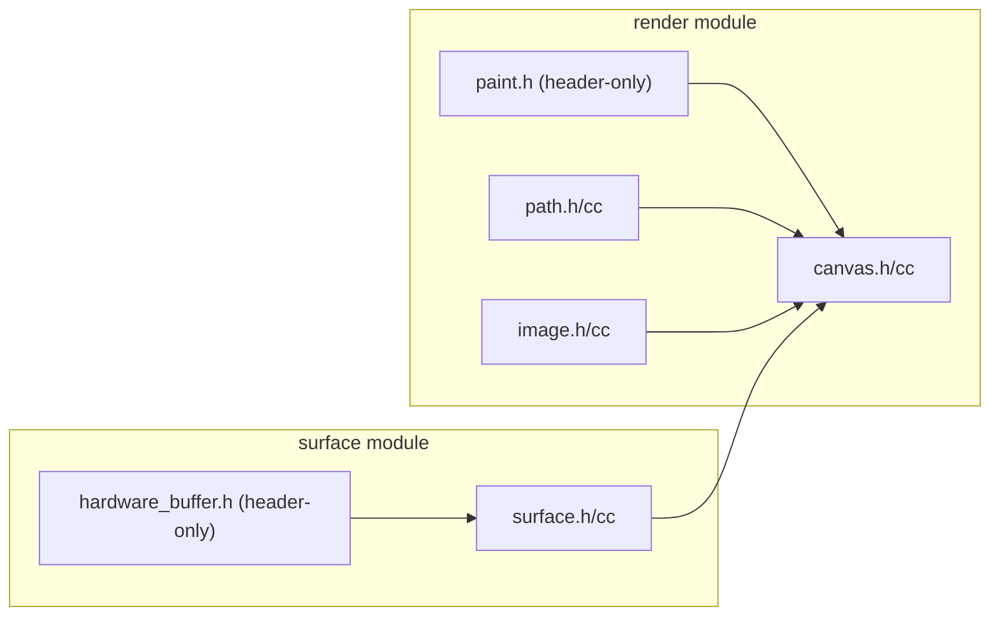

# Implementation Plan: Skia Render Wrapper & Surface

**Branch**: `005-skia-render-surface` | **Date**: 2026-07-29 | **Spec**: [spec.md](spec.md)

**Input**: Feature specification from `specs/005-skia-render-surface/spec.md`

## Summary

Build RAII wrappers over Skia's C++ API: `Surface` (backing store, Flush), `Canvas` (drawing context, auto save/restore), `Paint` (chainable style), `Path` (vector path), `Image` (decode from file/encoded data/hardware buffer), and `HardwareBuffer` (cross-platform buffer descriptor). Also create the `surface/` module for platform buffer support. These are the only modules that directly depend on Skia.

## Technical Context

**Language/Version**: C++17

**Build System**: Bazel 6.5.0

**Primary Dependencies**: Skia (via `@skia//:skia`), core types (Rect, Point, Size, Color)

**Storage**: N/A

**Testing**: googletest with pixel readback and golden image tests

**Target Platform**: macOS ARM64 (development), Linux x86_64 (CI)

**Project Type**: C++ library (internal render + surface modules)

**Performance Goals**: Canvas/Path/Paint are zero-cost wrappers (no heap alloc per draw call)

**Constraints**: C++17 only, no exceptions. Only render/ and surface/ modules may depend on Skia. No Skia types exposed in public headers.

## Constitution Check

Constitution file contains placeholder template — no binding principles defined. All gates PASS.

## Project Structure

### Documentation (this feature)

```text
specs/005-skia-render-surface/
├── spec.md
├── plan.md
├── research.md
├── data-model.md
├── quickstart.md
├── contracts/
│   └── render.md       # Surface/Canvas/Paint/Path/Image/HardwareBuffer API contract
└── tasks.md
```

### Source Code

```text
native_ui/src/framework/
├── render/
│   ├── BUILD.bazel           # cc_library with @skia//:skia dep
│   ├── canvas.h / canvas.cc  # Canvas RAII (Surface&, DrawRect/Text/Path/Image, Save/Restore)
│   ├── paint.h               # Paint chainable builder (header-only)
│   ├── path.h / path.cc      # Path vector path builder
│   └── image.h / image.cc    # Image decode (FromEncoded, FromFile, FromBuffer)
├── surface/
│   ├── BUILD.bazel           # cc_library with @skia//:skia dep
│   ├── surface.h / surface.cc # Surface backing store (Create, CreateFromBuffer, Flush)
│   └── hardware_buffer.h     # HardwareBuffer cross-platform wrapper (header-only)

native_ui/tests/
├── render_test.cc            # Canvas save/restore, Paint chain, Path construction
├── golden/                   # Golden test baselines
│   └── skia_spike_test.cc
└── surface_test.cc           # Surface creation, HardwareBuffer

native_ui/src/framework/public/include/native_ui/
├── render.h                  # Re-export render types
└── surface.h                 # Re-export Surface, HardwareBuffer
```

## Implementation Flow


