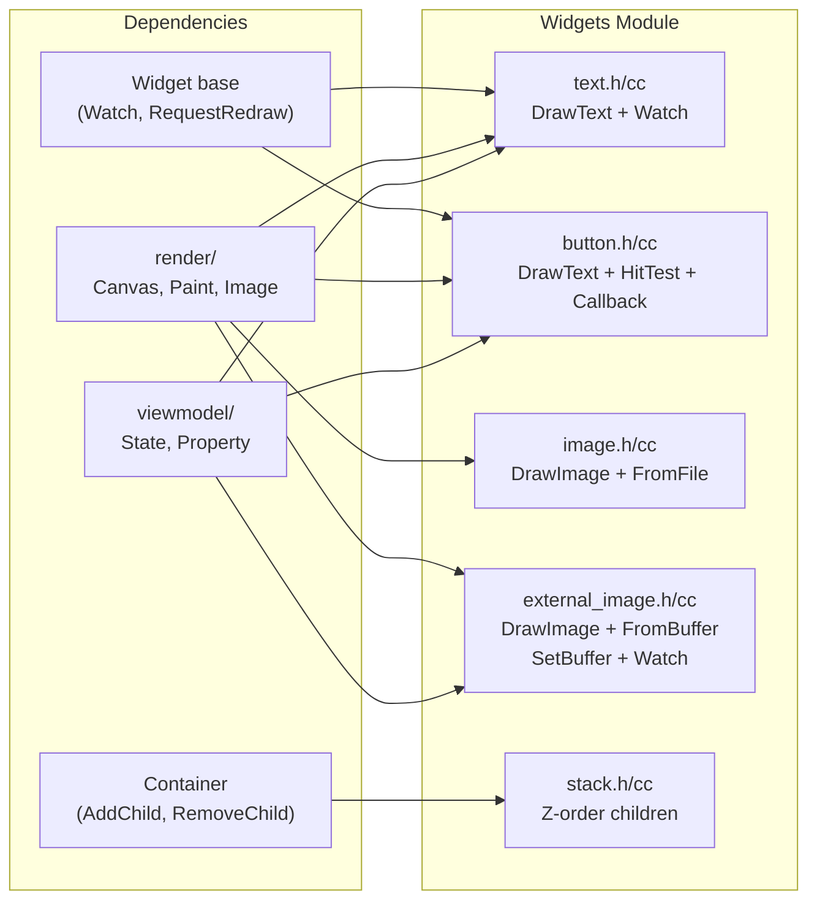

# Implementation Plan: Basic Widgets & Dynamic Tree

**Branch**: `006-basic-widgets-dynamic-tree` | **Date**: 2026-07-30 | **Spec**: [spec.md](spec.md)

**Input**: Feature specification from `specs/006-basic-widgets-dynamic-tree/spec.md`

## Summary

Implement `Text`, `Button`, `Image`, `ExternalImage`, `Stack` widgets with tagged-parameter construction, `Draw(Canvas&)` rendering, dynamic tree manipulation (`AddChild`/`RemoveChild`), and State data binding integration (`Watch(Property<T>&)` => auto `RequestRedraw`). Each widget uses the existing Canvas/Paint/Image/Surface render layer (P5) and the Widget/Container base (P3). `Image` handles file-based static images; `ExternalImage` handles platform hardware buffers (IOSurface/AHardwareBuffer/DMA-BUF). Stack uses z-order stacking (no Yoga). All widgets support `Id(...)` for `FindById` lookup.

## Technical Context

**Language/Version**: C++17

**Build System**: Bazel 6.5.0

**Primary Dependencies**: core types (Rect, Point, Size, Color), render (Canvas, Paint, Image, Path), viewmodel (State, Property\<T\>), widgets (Widget, Container), Yoga

**Storage**: N/A

**Testing**: googletest with pixel readback (render_test), widget unit tests

**Target Platform**: macOS ARM64 (development), Linux x86_64 (CI)

**Project Type**: C++ library (internal widgets module)

**Performance Goals**: Widget draw methods are called per frame — no heap allocation per Draw() call. Dynamic tree operations (AddChild/RemoveChild) complete in O(1) amortized. Data binding signal → redraw latency under 1 frame (16ms at 60fps).

**Constraints**: C++17 only, no exceptions. Widgets module may NOT depend on Skia directly (via render/ and surface/ only). TextLayout (SkParagraph) is explicitly deferred post-MVP — use Skia's simple DrawText API.

**Scale/Scope**: 5 new widget types (Text, Button, Image, ExternalImage, Stack), ~8 new source files, ~1 new test file, ~600–1000 lines of C++.

## Constitution Check

Constitution file contains placeholder template — no binding principles defined. All gates PASS.

## Project Structure

### Documentation (this feature)

```text
specs/006-basic-widgets-dynamic-tree/
├── spec.md              # Feature specification
├── plan.md              # This file
├── research.md          # Phase 0 output
├── data-model.md        # Phase 1 output
├── quickstart.md         # Phase 1 output
├── contracts/           # Phase 1 output
│   └── widgets.md       # Widget API contract additions
└── tasks.md             # Phase 2 output (speckit.tasks)
```

### Source Code

```text
native_ui/src/framework/widgets/
├── BUILD.bazel               # Add deps on //src/framework/render
├── widget.h / widget.cc      # Existing — add Watch/UnwatchAll impl
├── container.h / container.cc # Existing
├── text.h / text.cc           # NEW — Text widget
├── button.h / button.cc       # NEW — Button widget
├── image.h / image.cc         # NEW — Image widget (file-based static)
├── external_image.h / external_image.cc # NEW — ExternalImage widget (hardware buffer)
└── stack.h / stack.cc         # NEW — Stack widget

native_ui/src/framework/public/include/native_ui/
└── widgets.h                  # Update — re-export Text, Button, Image, ExternalImage, Stack

native_ui/tests/
├── BUILD.bazel                # Add widgets_test target
└── widgets_test.cc            # NEW — Text, Button, Image, Stack unit tests
```

**Structure Decision**: Follow existing single-project layout — all widget sources in `src/framework/widgets/`, tests in `tests/`. Public re-exports in `src/framework/public/include/native_ui/`. Matches existing Container/widget pattern.

## Implementation Flow


