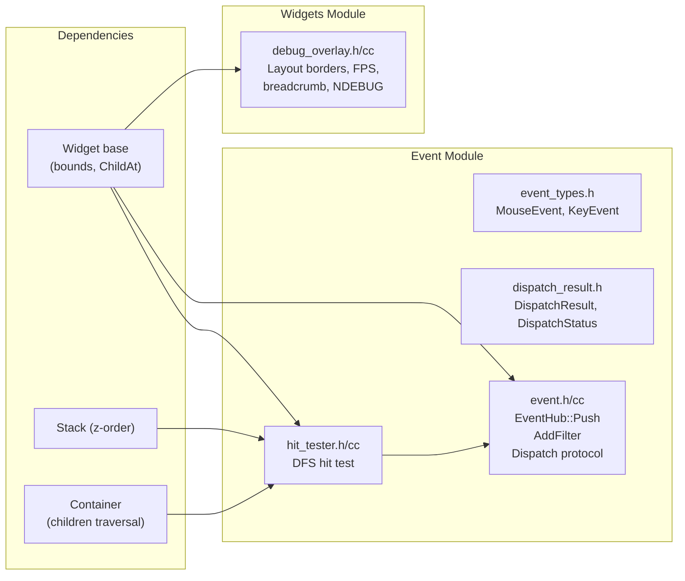

# Implementation Plan: Event System & Observability

**Branch**: `007-event-system-observability` | **Date**: 2026-07-30 | **Spec**: [spec.md](spec.md)

**Input**: Feature specification from `specs/007-event-system-observability/spec.md`

## Summary

Implement EventHub (unified external event entry point with Push/DispatchResult), HitTester (DFS hit testing on widget tree respecting z-order), dispatch protocol (filter → capture → target → bubble), event filter chain, and DebugOverlay (toggleable diagnostic widget with layout borders, FPS, breadcrumbs). Events are externally injected — framework does not own platform event loops. All tests use mock input events.

## Technical Context

**Language/Version**: C++17

**Build System**: Bazel 6.5.0

**Primary Dependencies**: core types (Point, Rect), widgets (Widget, Container, Stack, Button), render (Canvas, Paint)

**Storage**: N/A

**Testing**: googletest with mock input events (no platform event loop dependency)

**Target Platform**: macOS ARM64 (development), Linux x86_64 (CI)

**Project Type**: C++ library (event module + DebugOverlay widget)

**Performance Goals**: Event dispatch under 100µs for typical trees (<100 widgets). HitTest completes in O(depth). DebugOverlay adds <1ms per frame when visible.

**Constraints**: C++17 only, no exceptions. EventHub is main-thread only. No platform event loop ownership. All events are externally injected. DebugOverlay compiled out in release builds (`#ifndef NDEBUG`).

**Scale/Scope**: ~6 new source files (event.h/cc, hit_tester.h/cc, dispatch_result.h, debug_overlay.h/cc), ~2 new test files, ~400–600 lines of C++.

## Constitution Check

Constitution file contains placeholder template — no binding principles defined. All gates PASS.

## Project Structure

### Documentation (this feature)

```text
specs/007-event-system-observability/
├── spec.md              # Feature specification
├── plan.md              # This file
├── research.md          # Phase 0 output
├── data-model.md        # Phase 1 output
├── quickstart.md         # Phase 1 output
├── contracts/           # Phase 1 output
│   ├── event.md         # EventHub, DispatchResult, event types contract
│   └── debug_overlay.md # DebugOverlay widget contract
└── tasks.md             # Phase 2 output (speckit.tasks)
```

### Source Code

```text
native_ui/src/framework/event/
├── BUILD.bazel               # NEW — cc_library with deps on widgets, core
├── event.h / event.cc         # NEW — EventHub with Push, AddFilter, dispatch logic
├── hit_tester.h / hit_tester.cc # NEW — DFS hit testing on widget tree
└── dispatch_result.h          # NEW — DispatchResult, DispatchStatus enum

native_ui/src/framework/widgets/
├── BUILD.bazel               # Update — add deps on //src/framework/event if needed
└── debug_overlay.h / debug_overlay.cc # NEW — DebugOverlay widget (diagnostic overlay)

native_ui/src/framework/public/include/native_ui/
├── event.h                    # NEW — re-export EventHub, HitTester, DispatchResult
└── debug_overlay.h            # NEW — re-export DebugOverlay

native_ui/tests/
├── BUILD.bazel                # Add event_test + debug_overlay_test targets
├── event_test.cc              # NEW — EventHub::Push, HitTest, filter chain, dispatch
└── debug_overlay_test.cc      # NEW — DebugOverlay toggling, borders, breadcrumbs
```

**Structure Decision**: Follow existing single-project layout. Event system lives in a new `event/` module alongside existing modules. DebugOverlay lives in `widgets/` since it is a Widget subclass. Tests in `tests/`.

## Implementation Flow


