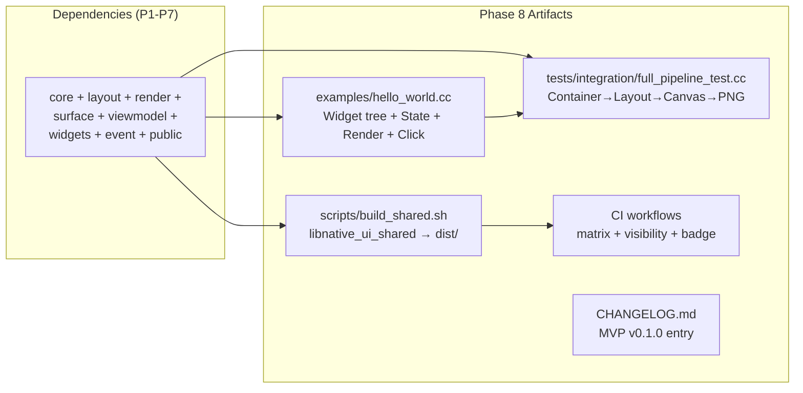

# Implementation Plan: Example, CI Polish & Release

**Branch**: `008-example-ci-release` | **Date**: 2026-07-30 | **Spec**: [spec.md](spec.md)

**Input**: Feature specification from `specs/008-example-ci-release/spec.md`

## Summary

Build an end-to-end Hello World example demonstrating the full MVP pipeline (widget tree → State data binding → FlexLayout → Skia render → PNG output), harden the CI pipeline (matrix build on macOS + Linux, visibility guard, caching, status badge), finalize the release process (shared library build script, GitHub Actions release workflow, CHANGELOG), and add a full-pipeline integration test.

## Technical Context

**Language/Version**: C++17

**Build System**: Bazel 6.5.0, GitHub Actions

**Primary Dependencies**: All framework modules (core, layout, render, surface, viewmodel, widgets, event, public)

**Storage**: N/A (file-based PNG output)

**Testing**: googletest for integration test; manual smoke test for example binary

**Target Platform**: macOS ARM64 (development), Linux x86_64 (CI matrix)

**Project Type**: C++ library + example application + CI/release infrastructure

**Performance Goals**: Example build under 30s, full CI pipeline under 10 min with caching

**Constraints**: C++17 only, no exceptions. Hello World example must use only public API headers. Shared library must be linkable from external Bazel projects.

**Scale/Scope**: ~1 example source file, ~1 integration test, ~3 CI workflow files, ~1 build script, ~1 CHANGELOG update

## Constitution Check

Constitution file contains placeholder template — no binding principles defined. All gates PASS.

## Project Structure

### Documentation (this feature)

```text
specs/008-example-ci-release/
├── spec.md              # Feature specification
├── plan.md              # This file
├── research.md          # Phase 0 output
├── data-model.md        # Phase 1 output
├── quickstart.md         # Phase 1 output
├── contracts/           # Phase 1 output
│   └── public-api.md    # Public API surface contract (what hello_world uses)
└── tasks.md             # Phase 2 output (speckit.tasks)
```

### Source Code

```text
native_ui/
├── examples/
│   ├── BUILD.bazel                # NEW — cc_binary for hello_world
│   └── hello_world.cc             # NEW — Full MVP example
├── tests/
│   ├── BUILD.bazel                # Update — add full_pipeline_test
│   ├── integration/
│   │   └── full_pipeline_test.cc  # NEW — Cross-module pipeline test
│   └── examples_test.cc           # NEW — Example smoke test
├── .github/workflows/
│   ├── ci.yml                     # Update — matrix build + visibility guard + caching
│   ├── pr.yml                     # Update — PR gate
│   └── release.yml                # NEW/N/A (check if exists)
├── scripts/
│   ├── BUILD.bazel                # NEW — sh_binary for script (optional)
│   └── build_shared.sh            # NEW — Shared library build + copy to dist/
├── CHANGELOG.md                   # Update — add MVP v0.1.0 entry
├── README.md                      # Update — add CI status badge
└── src/framework/public/
    └── BUILD.bazel                # Update — add native_ui_shared cc_shared_library target
```

**Structure Decision**: Follow existing single-project layout. Examples in `examples/`, workflows in `.github/workflows/`, scripts in `scripts/`. Shared library target added to public module.

## Implementation Flow


