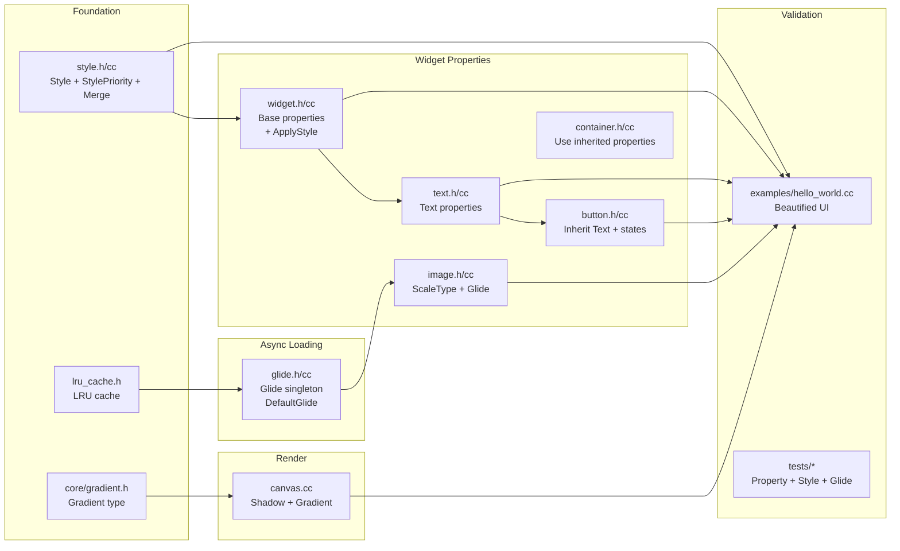

# Implementation Plan: Widget Property Enhancement

**Branch**: `009-widget-property-enhancement` | **Date**: 2026-07-30 | **Spec**: [spec.md](spec.md)

**Input**: Feature specification from `specs/009-widget-property-enhancement/spec.md`

## Summary

Enrich all basic widgets with a comprehensive set of visual and behavioral properties: Widget base gains Width, Height, MinWidth, MaxWidth, Padding, Background, BackgroundGradient, Enabled, Visible, Opacity, CornerRadius, BorderWidth, BorderColor, Shadow. Text adds FontSize, TextColor, TextAlign, FontFamily, FontWeight, LineHeight, MaxLines, TextDecoration. Button inherits Text plus NormalColor/PressedColor. Image adds ScaleType, ScaleGravity, and async loading via Glide. A Style class with per-property is_set flags and StylePriority enables reusable, mergeable, priority-based theming.

## Technical Context

**Language/Version**: C++17

**Build System**: Bazel 6.5.0

**Primary Dependencies**: core (Color, Rect, Point, Size), render (Canvas, Paint, Path), widgets (Widget, Text, Button, ImageWidget, Container, Stack), surface (Surface), Skia (shadow, gradient, font)

**Storage**: N/A

**Testing**: googletest with pixel readback verification for visual properties

**Target Platform**: macOS ARM64 (development), Linux x86_64 (CI)

**Project Type**: C++ library (framework widget property system)

**Performance Goals**: Style merge in O(num_properties). Property tags parsed at compile time via fold expressions. No per-frame allocation for property reads. Glide async decode on worker threads.

**Constraints**: C++17 only, no exceptions. All properties must work through Style (reusable) AND direct tags (explicit). No breaking changes to existing widget constructors. Glide is main-thread-only for Default/SetDefault. Style uses value copy.

**Scale/Scope**: ~10 new/modified source files, hundreds of lines of property infrastructure, 25 functional requirements, 5 user stories.

## Constitution Check

Constitution file contains placeholder template — no binding principles defined. All gates PASS.

## Project Structure

### Documentation (this feature)

```text
specs/009-widget-property-enhancement/
├── spec.md              # Feature specification
├── plan.md              # This file
├── research.md          # Phase 0 output
├── data-model.md        # Phase 1 output
├── quickstart.md         # Phase 1 output
├── contracts/           # Phase 1 output
│   ├── style.md         # Style class contract
│   ├── glide.md         # Glide async loader contract
│   └── property-tags.md # Widget property tag contracts
└── tasks.md             # Phase 2 output (speckit.tasks)
```

### Source Code

```text
native_ui/src/framework/core/
├── core.h                      # MODIFY — re-export gradient.h
├── edge_insets.h               # EXISTING — EdgeInsets type used by Padding tag
└── gradient.h                  # NEW — Gradient type (Linear, Radial, ColorStop)

native_ui/src/framework/widgets/
├── widget.h / widget.cc        # MODIFY — add `Style style_` member (single storage for all
│                               #          visual/behavioral props), ProcessArg delegates to
│                               #          Style::setXxx, ApplyStyle auto-RequestRedraw,
│                               #          Draw reads from style(), remove Size tag from Container
├── style.h / style.cc          # NEW — Style class, StylePriority, Merge
├── text.h / text.cc            # MODIFY — ProcessArg(Content/FontSize/TextColor/etc.) delegates
│                               #          to style_.setXxx; Draw reads from style()
├── button.h / button.cc        # MODIFY — change base from Widget to Text,
│                               #          add NormalColor, PressedColor
├── image.h / image.cc          # MODIFY — add ProcessArg delegating ScaleType/ScaleGravity/
│                               #          Placeholder/ErrorImage to style_.setXxx();
│                               #          Glide integration with Load/Cancel lifecycle;
│                               #          Draw reads ScaleType from style()
├── container.h / container.cc  # MODIFY — remove duplicate Size tag and layout_size_,
│                               #          use inherited Width/Height from Widget base
├── glide.h / glide.cc          # NEW — Glide singleton, DefaultGlide implementation
└── lru_cache.h                 # NEW — LRU cache used by DefaultGlide

native_ui/src/framework/render/
└── canvas.cc                   # MODIFY — support shadow rendering via Skia dropShadow,
│                              #          gradient shader via SkGradientShader

native_ui/tests/
├── widgets_test.cc             # MODIFY — add property rendering tests
├── style_test.cc               # NEW — Style merge, priority, ApplyStyle tests
└── glide_test.cc               # NEW — Glide async load, cache, cancel tests

examples/
└── hello_world.cc              # MODIFY — apply new properties for beautified UI
```

**Structure Decision**: Style is the single source of truth for all visual/behavioral properties — each Widget holds a `Style style_` member. Property tags in ProcessArg delegate to Style::setXxx. ApplyStyle merges and auto-calls RequestRedraw(). Draw reads from style(). This eliminates 15+ duplicate member fields per widget. Container's `Size{}` tag and `layout_size_` are removed, replaced by Width/Height stored in style_. Hello World updated at `examples/hello_world.cc`.

## Implementation Flow


