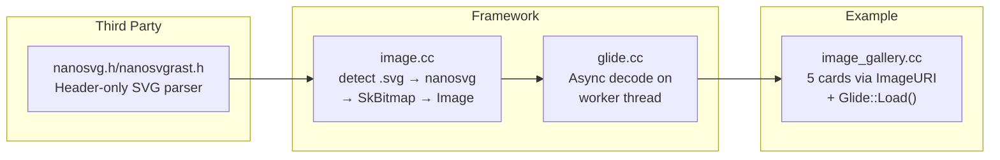

# Implementation Plan: SVG Image Support

**Branch**: `010-svg-image-support` | **Date**: 2026-07-30 | **Spec**: [spec.md](spec.md)

**Input**: Feature specification from `specs/010-svg-image-support/spec.md`

## Summary

Add SVG image loading support to the framework via nanosvg (header-only SVG rasterizer). Extend `Image::FromFile()` to detect `.svg` files and route to nanosvg for XML parsing + rasterization into a Skia bitmap. Load images asynchronously via Glide on worker threads. Add `examples/image_gallery.cc` — a widget layout that displays 5 ImageWidget+Text cards (2 SVG + 3 PNG) with different ScaleType modes to validate the full pipeline.

## Technical Context

**Language/Version**: C++17

**Build System**: Bazel 6.5.0

**Primary Dependencies**: core, render, widgets (ImageWidget, Glide), surface, utils (PngWriter), nanosvg (header-only)

**Storage**: N/A (local file system reads)

**Testing**: Manual via `examples/image_gallery.cc` — visual validation of output PNG

**Target Platform**: macOS ARM64 (development), Linux x86_64 (CI)

**Project Type**: C++ library (SVG parsing integration + example)

**Performance Goals**: SVG rasterization under 100ms for typical icon SVGs (<100KB). Glide worker thread decode avoids main thread blocking.

**Constraints**: C++17 only, no exceptions. nanosvg must be header-only (no `.cpp` build step). SVG rasterized to RGBA bitmap at widget resolution. No Skia SVG DOM dependency.

**Scale/Scope**: 1 third-party header (nanosvg.h), 1 new example source file, ~10 lines modified in Image::FromFile routing.

## Constitution Check

Constitution file contains placeholder template — no binding principles defined. All gates PASS.

## Project Structure

### Documentation (this feature)

```text
specs/010-svg-image-support/
├── spec.md              # Feature specification
├── plan.md              # This file
├── research.md          # Phase 0 output
├── data-model.md        # Phase 1 output
├── quickstart.md         # Phase 1 output
├── contracts/           # Phase 1 output
│   └── nanosvg.md       # nanosvg integration contract
└── tasks.md             # Phase 2 output (speckit.tasks)
```

### Source Code

```text
native_ui/third_party/nanosvg/
├── BUILD.bazel          # NEW — cc_library wrapping nanosvg.h header
├── nanosvg.h            # NEW — downloaded nanosvg header (zlib license)
└── nanosvgrast.h        # NEW — downloaded nanosvg rasterizer header

native_ui/src/framework/render/
├── image.h / image.cc   # MODIFY — detect .svg extension, call nanosvg rasterizer

native_ui/examples/
├── BUILD.bazel          # MODIFY — add image_gallery cc_binary target
└── image_gallery.cc     # NEW — 5-card gallery with SVG + PNG ScaleType comparison

native_ui/scripts/
└── fetch_nanosvg.sh     # NEW — downloads nanosvg headers from GitHub
```

**Structure Decision**: nanosvg is a third-party header-only library, no compilation needed. `Image::FromFile` gains a `.svg` detection branch. The example lives alongside `hello_world` under `examples/`. Asset images remain in `assets/photo/`.

## Implementation Flow


